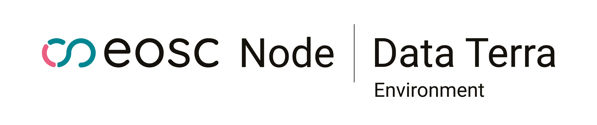

# Environmental Sciences Research Software & Tools

**Mission**: Promote best practices for Research Software in environmental sciences and federate tools across EOSC nodes — spanning Earth System, Climate, Biodiversity, Ecology, and Marine science communities.

---

## 🌍 About Us

We are a cross-EOSC node initiative bringing together the environmental science communities to:

- **Champion best practices** for Research Software development, sustainability, citation, and reuse, aligned with **FAIR** and **FAIR4RS** principles.
- **Federate tools and catalogs** across Earth System, Climate, Biodiversity, Ecology, and Marine science domains.
- **Improve interoperability** between Virtual Research Environments (VREs), platforms, and infrastructures.
- **Establish shared governance** for tool repositories, reviews, contributions, and quality criteria.
- **Build a community-driven catalog** of research software for environmental sciences, inspired by [bio.tools](https://bio.tools/) but designed for the full breadth of our domains.
- **Act as a centre of excellence** — a reference point for developers, researchers, and infrastructures across the European Open Science Cloud (EOSC).

---

## 🌐 Scope

Environmental sciences span many connected domains, and so do we:

- 🌡️ **Climate** — atmospheric models, climate projections, reanalysis tools
- 🌎 **Earth System** — solid earth, hydrology, cryosphere, geodesy
- 🌿 **Biodiversity & Ecology** — species data, ecological modeling, ecosystem services, virtual research environments
- 🌊 **Marine & Ocean** — observations, biogeochemistry, marine biodiversity
- 🛰️ **Earth Observation** — satellite and in-situ data processing

We work across these domains rather than siloing them, because the science increasingly demands it.

---

## 💬 Where to find us

Join us on Matrix: [#galaxyproject_earth-climate-ecology-sciences:matrix.org](https://matrix.to/#/#galaxyproject_earth-climate-ecology-sciences:matrix.org)

Our community is supported by maintainers across domains:

- **Anne** — Climate
- **Marie** — Earth System science
- **Yvan** — Ecology — see also the [tools-ecology repository](https://github.com/galaxyecology/tools-ecology)
- **[TBD]** — Biodiversity (LifeWatch ERIC)
- **[TBD]** — Marine (contributions welcome)

Together, we help users and developers with questions, ideas, and challenges around modeling, data, processes, software engineering, and cross-disciplinary topics.

---

## 🤝 How to Contribute

1. **Reach out** — join the [Matrix room](https://matrix.to/#/#galaxyproject_earth-climate-ecology-sciences:matrix.org).
2. **Join the discussion** — open an issue in the [earth-data-community](https://github.com/earth-data-community) repository.
3. **Propose tools** — submit a PR to add your software to the catalog, following our metadata and quality guidelines.
4. **Review & merge** — follow the governance guidelines (TBD).
5. **Share best practices** — contribute to our guides on research software sustainability, citation, packaging, testing, and reproducibility.

---

## ✨ Vision

> *"A federated, interoperable ecosystem for environmental science research software — across Earth System, Climate, Biodiversity, Ecology, and Marine domains — accessible across platforms and aligned with FAIR and FAIR4RS principles."*

---

## 🙏 Acknowledgments

This initiative builds on the work of communities, infrastructures, and EOSC nodes that have championed open science and sustainable research software in environmental sciences. We are grateful for their leadership and ongoing collaboration.

In particular, we recognize:

- **[Data Terra](https://www.data-terra.org/)** — for its leadership in Earth System data infrastructure, open science, and the EOSC Node it operates.
- **[LifeWatch ERIC](https://www.lifewatch.eu/)** — the European e-Science infrastructure for biodiversity and ecosystem research, providing virtual labs, services, and a thriving community across the biodiversity domain.
- **[ENVRI](https://envri.eu/)** — the cluster of European environmental research infrastructures driving cross-domain integration across atmosphere, marine, solid earth, and biodiversity.

Their expertise in **data interoperability**, **FAIR principles**, **community-driven research**, and **research software sustainability** has been instrumental in shaping this initiative — and remains central to its future.

---

### Supported by

